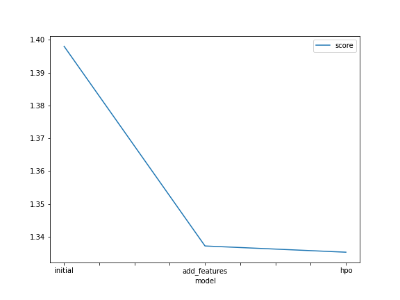
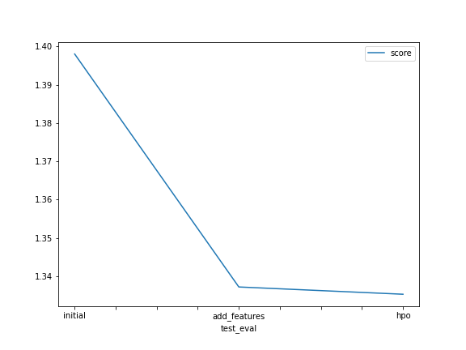

# Report: Predict Bike Sharing Demand with AutoGluon Solution
#### Bhoomika Mewada

## Initial Training
### What did you realize when you tried to submit your predictions? What changes were needed to the output of the predictor to submit your results?
When submitting the predictions of the dataset , I found out that there are some negative values for RMSE score. And those negative values need to be modified to zero, so we set those negative values to zero. And we also need to change the data type of datetime from object to datetime. 

### What was the top ranked model that performed?
The model that gave good rmse score is the last model which I trained by modifying hyperparameters.

## Exploratory data analysis and feature creation
### What did the exploratory analysis find and how did you add additional features?
Getting information about the data and its data type and converting the data type of the columns as per the requirements and insight about it, and removing the parameters that did not affected the prediction of the output helped to optimise the performance of the model. 

### How much better did your model preform after adding additional features and why do you think that is?
Model significantly performed better after adding the additional features. RMSE score reduced from 1.39804 to 1.33719. 

## Hyper parameter tuning
### How much better did your model preform after trying different hyper parameters?
Model significantly performed better after adding the additional features. RMSE score reduced from 1.33719 to 1.29161. 

### If you were given more time with this dataset, where do you think you would spend more time?
1. Evaluate different model algorithms.
2. Choose the best performing model algo.
3. Perform hyperparameter tuning on best chosen model.
4. Get the best performing model after tuning and compare the results against the initial benchmark or kaggle leaderboard to assess how well final model performed.
5. I would also explore on different feature engineering techniques such as feature scaling,normalization and removing outliers.

### Create a table with the models you ran, the hyperparameters modified, and the kaggle score.
|model|time|num_bag_folds|num_bag_sets|num_stack_levels|score|
|--|--|--|--|--|
|initial|600|-|-|-|1.39592|
|add_features|600|-|-|-|1.33719|
|hpo1|600|5|1|1|1.33529|
|hpo1|600|20|20|1|1.28245|
|hpo2|600|0|0|0|1.29161|
### Create a line plot showing the top model score for the three (or more) training runs during the project.

### Create a line plot showing the top kaggle score for the three (or more) prediction submissions during the project.

## Summary
In this project we need to build a regression model using AUTO GLUON to predict the demands on the basis of historical data. At first prediction is determined using the default parameters. Initially The RMSE score of the model is high. 

Next step was to perform EDA and analyze data pattern in features. Based on plots I took decision to engineer existing feature changing dtype from numeric to categorical,changing to datetime and added new features to capture time element information for each record.

With preprocessed features, I decided to tune hyperparameters for model algorithm. Two of my choice were GBM and neural network with different hyperparameter setting. After the training the model for increased duration I couldn't get model any better. and there was increase in RMSE score.

At last I compared the Kaggle score of all trained model and plotted these scores against hyperparameter settings to analyze the relative improvement or degradation in performance.